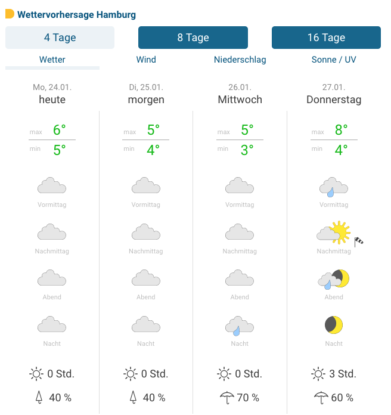

# computerbild.de and autobild.de software developer coding task

## Brief

The goal should be to build some weather data that shows a preview of a given city based on a weather API.

You can clone this repository and create a [git bundle](https://git-scm.com/docs/git-bundle) and send it to us when you complete the task.
Our focus is on the structure, the API implementation, the commit process and the output.

### Details: 

**City JSON:** ./packages/sample-data/germany.json

- The user should be able to select a city via a filter using the City JSON.
- The list of cities is to be prepared and accessed via the backend.
- Based on the user selection, the weather data for the next 4 days should then be retrieved via a backend service using the [Openweathermap API](http://api.openweathermap.org/data/2.5/forecast?q=hamburg&appid=a1662cb667d77b98cdd83e278af62b30).
- The weather data can be based on the weather forecast from [wetteronline.de](https://www.wetteronline.de/?pcid=pc_city_weather&pid=p_city_weather&sid=MediumTerm&prefpar=weather&gid=10147&lat=53.55&locationname=Hamburg&lon=9.983&iid=[object%20Object]&print=false).
- A small express server with two sample controllers is already prepared in the backend.
- On the other hand, feel free to add or change the features to improve UX.

## Design

**example could be:** 

**Icons:** https://github.com/erikflowers/weather-icons/tree/master/svg

**Font:** https://fonts.google.com/specimen/Roboto?query=roboto

## Tech Stack

- Typescript
- VueJs
- HTML
- CSS

## Acceptance Criteria

- Using Typescript for the backend is mandatory.
- The app should be working and buildable with no errors.
- There should be individual commits with meaningful commit messages.